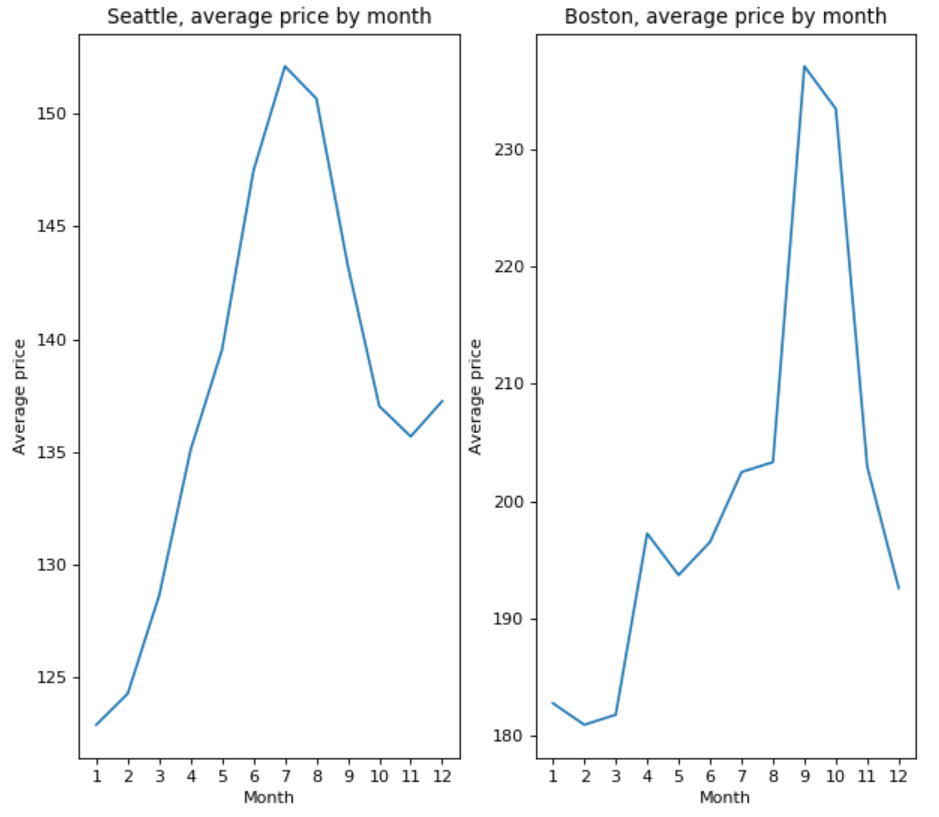

Some travelers have a tight budget. Some others travel not to go sightseeing but to spend
time with family or friends. They do not need the weather to be gorgeous. They wan to 
travel with a low cost. We obtained some AirBnb lodging price data for Seattle and Boston 
via Udacity, an online learning platform and we explore the data to gain insights. If you
fit in the aforementioned traveling types, read on. We have a treat for you. We will tell
you, based on the analysis we perform, what are the best months to travel to these two 
cities and the type of properties that will save you money on lodging. 

